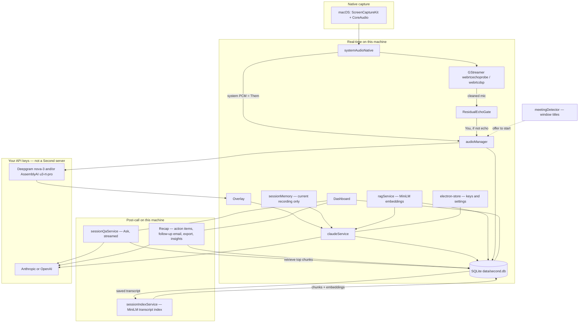

<p align="center">
  <picture>
    <source media="(prefers-color-scheme: dark)" srcset="logo/second_full-white.svg" />
    
  </picture>
</p>

<p align="center">
  <strong>A private live meeting intelligence layer.</strong><br />
  For interviews, founder and investor calls, negotiations, and the meetings where one sentence matters.
</p>

<p align="center">
  <a href="https://github.com/CommonCapital/Second/releases/latest"></a>
  <a href="LICENSE"></a>
  
</p>

---

Second sits quietly beside your call. It hears **You** and **Them** on separate streams, understands where the conversation is going, and surfaces one useful line — the question to ask, the fact to remember, the close to land — only when it is worth interrupting you. After the call it hands you the outcome, commitments, open questions, and a follow-up draft.

**The goal: you forget the software is there and simply have a better meeting.**

- **Yours.** No Second account, no hosted backend, no cloud sync. Sessions live in local SQLite on your machine.
- **Bring your own keys.** Transcription uses your **Deepgram** or **AssemblyAI** key; intelligence uses your **Anthropic** or **OpenAI** key. Nothing goes to a Second server, because there isn't one.
- **Quiet by design.** A small overlay, keyboard-first, invisible to typical screen shares.

See [docs/PRIVACY.md](docs/PRIVACY.md) for exactly what leaves your machine and when.

## Principles

1. **Judgment over transcription.** The transcript exists to make the next decision better.
2. **One glance.** A suggestion should be understood in about a second and sound natural spoken aloud.
3. **Silence is intelligence.** Often the right move is to keep listening.
4. **Timing outranks eloquence.** A great line after the moment passes is a failed line.
5. **Facts before inference.** Keep what was said, what is known, and what is guessed clearly apart.
6. **Never spend credibility casually.** No bluffing, invented authority, or unearned certainty.
7. **Close the loop.** Track open questions, commitments, owners, and the next step.

## Download

<p>
  <a href="https://github.com/CommonCapital/Second/releases/download/Installation/Second-Mac-0.1.0-Installer.dmg"></a>
</p>

| Platform | Installer | Size |
|----------|-----------|------|
| **macOS 12+ (Apple Silicon)** | [Second-Mac-0.1.0-Installer.dmg](https://github.com/CommonCapital/Second/releases/download/Installation/Second-Mac-0.1.0-Installer.dmg) | 235 MB |
| **macOS 12+ (Apple Silicon)**, zip | [Second-Mac-0.1.0-Installer.zip](https://github.com/CommonCapital/Second/releases/download/Installation/Second-Mac-0.1.0-Installer.zip) | 227 MB |

All builds: [GitHub Releases](https://github.com/CommonCapital/Second/releases). Second runs on macOS 12+ with Apple Silicon. Intel Macs: build from source ([Getting Started](#getting-started)).

### Install on macOS

1. Open the **DMG** and drag **Second** into **Applications**. (Using the zip: double-click it, then drag **Second.app** into Applications.)
2. **First launch only:** right-click **Second** in Applications → **Open** → **Open**. This build is not yet signed with an Apple Developer ID, so a plain double-click is blocked the first time. If macOS still refuses, go to **System Settings → Privacy & Security** and click **Open Anyway**.
3. Follow onboarding: add your own API keys (Deepgram or AssemblyAI for transcription; Anthropic or OpenAI for intelligence) and allow **Microphone** and **Screen Recording** (Screen Recording is how macOS exposes system audio).
4. **Settings → Second → Run test** to confirm both *You* and *Them* are heard before your first real meeting.

> **Early build (0.1.0).** Echo cancellation uses GStreamer. On a Mac without Homebrew's GStreamer (`brew install gstreamer`), Second still works but runs without echo cancellation; use headphones so the other side doesn't leak into your own transcript. A fully self-contained build is on the roadmap.

Installed copies check GitHub Releases for updates (`latest-mac.yml`) and only offer a build **newer** than the one you have. Maintainers: see [Releasing](CONTRIBUTING.md#releasing).

---

## Features (shipping today)

### The live judgment layer

- **One card at a time** — SAY, ASK, WATCH, WAIT, or CLOSE, usually 22 words or fewer, only when it beats silence. Each card shows its mode and expires when it stops being actionable. Keep, dismiss, or ask the deeper model to think again. `Cmd + Shift + Enter` asks for the best move now.
- **Meeting state, not a giant prompt** — A deterministic reducer tracks the objective, topic, facts (with the turn they came from), numbers (contradictions flagged automatically), open questions, objections, commitments (missing dates flagged), capture gaps, and the next best action. The coach sees this state plus the last few turns, never the whole transcript. See the **State** tab in the overlay.
- **Intervention engine** — Coaching runs only after meaningful finalized turns. Cards are held back when confidence is low, they repeat, the current card is still being used, the other side is mid-answer, or a question you just asked is still pending.
- **Meeting modes** — General executive, Founder / investment, LP / allocator, Interview, Banker / sponsor, Negotiation, IC / portfolio, Relationship. A mode changes the objective, guardrails, close target, and how often Second speaks.
- **Prepare meeting** — Type, who, objective, ideal outcome, what must not happen, and pasted context produce a 90-second brief: three facts to remember, three questions to land, likely hard questions, and the close target.
- **Your professional profile** — Edited in Settings, versioned on every save. Dynamic context (deals, workstreams) is used only when a meeting mentions it, and flagged stale after 30 days.
- **Post-meeting report** — Outcome, decisions, commitments, open questions, risks, next step, a short follow-up draft, and proposed profile updates you approve before anything is saved.
- **No false green** — A status rail per channel (mic, meeting audio, both transcripts, coach, network) with plain-English failures ("I can hear you, not the meeting"). A dual-audio self test in Settings proves both sides before a call. Sleep and network loss are marked as gaps.
- **Private by default** — Transcripts are deleted after notes are written unless you turn retention on. API keys never reach the UI process. Diagnostics carry no content.

### Capture, transcription, and history

- **Dual-stream capture** — System audio + microphone via ScreenCaptureKit + CoreAudio.
- **Echo cancellation** — GStreamer `webrtcechoprobe` / `webrtcdsp` (WebRTC AEC3), then a **residual echo gate** that drops mic chunks that still look like speaker bleed before they reach STT.
- **Real-time transcription** — Two streams: **You** (cleaned mic) and **Them** (system audio). Deepgram `nova-3` and/or AssemblyAI `u3-rt-pro`. Auto-routing prefers AssemblyAI for English, Spanish, French, German, Portuguese, and Italian when that key is present; otherwise Deepgram. Settings can force either engine.
- **AI assistance** — Anthropic or OpenAI from the overlay (Assist, recap, follow-up, and custom prompts). Optional screenshot via `desktopCapturer`.
- **Private overlay** — The overlay and dashboard use Electron `setContentProtection`, so they are left out of typical screen shares (Zoom, Meet, Teams). Not a guarantee against every capture tool.
- **Modes** — Local behavior profiles (system prompt, notes templates). Attach documents for RAG on that mode.
- **RAG (per mode, local)** — Upload `.txt`, `.md`, `.pdf`, or `.docx`. Chunked and embedded on-device with `Xenova/all-MiniLM-L6-v2` (`@xenova/transformers`). Chunks live in SQLite; the top matches are injected into the Assist system prompt. First embed may download the ~30MB model.
- **Session context (not long-term memory)** — During a recording, Assist keeps recent turns, pins the opening transcript and your typed questions, and may compress older context with a cheap model. That compacted memory is stored **on the session row** (local SQLite, deleted with the session) so a resumed session can pick it back up. There is **no** cross-meeting user-memory profile.
- **Sessions** — Saved locally in SQLite (transcript, overlay chat, auto title/summary). Dashboard can generate insights with your LLM key. **Resume** a saved session to keep recording into it later (a multi-day interview stays one session, and Assist remembers the earlier sitting). **Incognito** skips SQLite persistence for that session.
- **Ask your meetings** — A per-session **Ask** tab answers from that call's transcript; **Ask across all meetings** searches your whole history with on-device retrieval (`Xenova/all-MiniLM-L6-v2`) and cites the source sessions. Answers stream token-by-token; conversations are saved (one per session, plus multi-chat for the global view).
- **Post-call recap** — Structured **action items** (task, owner, deadline), a one-click **follow-up email** draft, **talk ratio** (You vs. Them, word-based), and **export** to Markdown or PDF. All generated with your own key; nothing goes to a Second server.
- **Meeting auto-start** — Optionally detect a Zoom, Google Meet, Microsoft Teams (including 1:1 calls), or Webex meeting and prompt — or auto-start — a recording. No bot joins; detection just reads open window titles locally. Off / prompt / auto in Settings.
- **In-app updates** — Installed builds check this repo's GitHub Releases: **Update now** downloads, **Restart & update** installs. Your keys and history are untouched.
- **Local settings** — API keys and preferences in encrypted `electron-store` (`second-config.json`).
- **Menu bar** — Second lives in the macOS menu bar (`resources/tray`).
- **Profile picture editor** — Crop, zoom, and pan before saving your avatar.

Live recording uses the **OS default** mic and playback devices. The Settings mic picker is for the in-app mic **test** only.

## Roadmap

Second is built in phases. Each phase has an exit condition; the next starts only when it is met. Current status: [docs/PRODUCT_SOURCE_OF_TRUTH.md](docs/PRODUCT_SOURCE_OF_TRUTH.md#status-against-the-build-sequence). Release bar: [RELEASE_GATE.md](RELEASE_GATE.md).

| Phase | Work | Exit condition |
|-------|------|----------------|
| 1. Consolidate | One production code path for capture, transcription, and coaching | Replayable realtime loop with no regressions |
| 2. Stabilize capture | Permissions, mic/system meters, dual-audio self test, device-change recovery | A fresh Mac passes preflight and survives a 30-minute call |
| 3. Meeting state | Event log + deterministic state reducer (topic, open questions, facts, numbers, commitments, objections) | Replaying a meeting reproduces the same state |
| 4. Context | Editable profile, meeting-mode playbooks, pre-meeting brief, scoped retrieval | Mode-appropriate behavior with no external memory attached |
| 5. Coaching | Intervention gate, one-card output (**SAY / ASK / WATCH / WAIT / CLOSE**), stale-card expiry | Curated evals reach quality and latency thresholds |
| 6. Hardening | Credential handling, retention defaults, diagnostics, crash recovery, signing | Release candidate passes privacy and failure tests |
| 7. Ship and learn | Real meetings, feedback capture, growing eval suite | Trusted in real high-stakes calls without supervision |

Not planned for v1: a meeting bot that joins the call, autonomous emails or calendar actions, a team dashboard, or a CRM.

## Architecture



**What “memory” means here**

| Mechanism | Lifetime | Used for |
|-----------|----------|----------|
| Live Assist turns | Current recording, in RAM | Last few turns replayed verbatim |
| Assist `sessionMemory` | Until you delete the session (SQLite, `assist_memory_json`) | Running summary, pinned opening, pinned questions; restored when you **Resume** that session |
| SQLite sessions / messages | Until you delete them | History, summaries, insights, overlay chat replay |
| RAG chunks | Until you remove the file from the mode | Retrieve-then-prompt on Assist, scoped to that mode |
| Session Ask index | Until you delete the session | Retrieve-then-prompt for **Ask across all meetings** (on-device MiniLM) |
| Ask conversations | Until you delete the chat / session | Saved Ask history — one per session, plus standalone global threads |
| electron-store | Until you reset settings | Keys, STT preference, window bounds — not semantic memory |

There is no global “Second remembers you across meetings” store.

## How It Works

1. You start a session (`Cmd + Shift + Space`, or the overlay). Incognito, if enabled, will not write the session to SQLite.
2. A native helper captures system audio and microphone at the same time.
   - Swift `audiocapture` — ScreenCaptureKit (system) + CoreAudio (mic). Needs Microphone and Screen Recording.
3. System PCM is the AEC **reference**. Mic PCM goes through GStreamer `webrtcechoprobe` / `webrtcdsp`. `ResidualEchoGate` then compares raw mic to recent system audio and drops leftover speaker echo so it does not land in **You**.
4. Two STT connections run in parallel (mic → You, system → Them). Engine pick is Settings `sttProvider` (`auto` / `assemblyai` / `deepgram`) plus language: AssemblyAI Universal-3 Pro for the six languages above when that key exists; Deepgram `nova-3` otherwise (including auto-detect / `multi`). AssemblyAI failures can fall back to Deepgram.
5. The overlay shows the live transcript. Assist (`Cmd + Enter`) builds a prompt from the mode brief, retrieved RAG chunks (if the mode has docs), session memory, recent chat, transcript tail, and an optional screenshot, then streams from your LLM.
6. On stop, a non-incognito session is saved. A cheap/fast model writes a title and summary. Insights are generated later from the dashboard, still with your key.

## Project Structure

```
src/
├── main/                         # Electron main process
│   ├── audioManager.ts           #   Recording orchestration, STT engine pick
│   ├── systemAudioNative.ts      #   Native capture + AEC wiring
│   ├── residualEchoGate.ts       #   Post-AEC mic echo drop before STT
│   ├── transcriptionService.ts   #   Deepgram dual WebSocket
│   ├── claudeService.ts          #   Overlay Assist (Claude / OpenAI)
│   ├── store.ts                  #   electron-store (encrypted keys + settings)
│   ├── meetingDetector.ts        #   Meeting auto-start from window titles
│   ├── index.ts                  #   App lifecycle, hotkeys, IPC
│   ├── second/                   #   Second live engine
│   │   ├── liveEngine.ts         #     Turns -> state -> gated coach -> one card
│   │   ├── coachService.ts       #     Compact prompt + structured card call
│   │   ├── healthMonitor.ts      #     Per-channel truth state for the status rail
│   │   ├── briefingService.ts    #     Pre-meeting brief, post-meeting report
│   │   ├── diagnostics.ts        #     Content-free local telemetry
│   │   └── secondMain.ts         #     Wiring: sessions, audio taps, IPC, retention
│   └── services/
│       ├── database.ts           #   SQLite (sessions, modes, RAG chunks, Ask index + chats)
│       ├── sessionManager.ts     #   Session lifecycle, incognito, autosave
│       ├── ragService.ts         #   Parse, embed, retrieve
│       ├── assemblyAITranscriptionService.ts
│       ├── summaryService.ts     #   Post-session title + summary
│       ├── insightsService.ts    #   Dashboard insights
│       ├── sessionQaService.ts   #   Ask (per-session + across all), streamed
│       ├── sessionIndexService.ts #  Transcript index for Ask (MiniLM)
│       ├── sessionExportService.ts # Markdown / PDF export
│       ├── followupEmailService.ts # Follow-up email draft
│       └── ai/
│           ├── providerFactory.ts
│           └── sessionMemory.ts  #   In-recording compression / pins
├── shared/
│   ├── second/                   # Pure, tested core: meeting state reducer, card
│   │                             #   contract, voicebook, intervention gates,
│   │                             #   playbooks, profile, health truth table, evals
│   └── sttCapabilities.ts        # STT language + engine routing
├── renderer/                     # React UI (Vite + Tailwind)
├── preload/                      # Context bridge
└── native/
    ├── swift/AudioCapture/       # macOS capture
    └── aec/                      # GStreamer AEC addon

prompts/second_core.md            # Versioned core coach prompt
schemas/                          # card.json, meeting_state.json
evals/                            # Scenario corpus + live replay runner
diagnostics/README.md             # Failure signatures, safe log fields
RELEASE_GATE.md                   # Acceptance checklist
```

## Platform Support

| Platform | System Audio | Microphone | Echo Cancellation | Status |
|----------|-------------|------------|-------------------|--------|
| **macOS 12+** | ScreenCaptureKit | CoreAudio | GStreamer AEC3 | Supported |

Second is macOS-only. The prebuilt DMG is **Apple Silicon**; Intel Macs can build from source (below). Second has no login, cloud sync, or meeting bot — capture happens on your machine.

## Getting Started

If you only want to run Second, use a [prebuilt installer](#download) instead of this section.

This walkthrough is for building from source — from a fresh Mac to a running app. Follow every numbered step in order, and verify each one before moving on.

> **API keys** (entered in-app on first launch — nothing to configure beforehand):
>
> - [Deepgram](https://console.deepgram.com) or [AssemblyAI](https://www.assemblyai.com) — real-time transcription
> - [Anthropic](https://console.anthropic.com) or [OpenAI](https://platform.openai.com) — AI assistance

---

### macOS Setup

> Tested on macOS 12 (Monterey) through macOS 15 (Sequoia), Intel and Apple Silicon.

**Step 1 — Install Xcode Command Line Tools**

```bash
xcode-select --install
```

A system dialog will appear — click **Install** and wait for it to finish (~2 min).

Verify:
```bash
xcode-select -p
# Expected: /Library/Developer/CommandLineTools  (or an Xcode.app path)
```

> **If you see** `xcode-select: error: command line tools are already installed` — you're good, move on.

---

**Step 2 — Install Node.js 22**

Install via [nvm](https://github.com/nvm-sh/nvm) (recommended). Skip the `curl` line if you already have nvm.

```bash
curl -o- https://raw.githubusercontent.com/nvm-sh/nvm/v0.40.1/install.sh | bash
```

**Close and reopen your terminal**, then:

```bash
nvm install 22
nvm use 22
```

Verify:
```bash
node -v
# Expected: v22.x.x (any 22+ version)
```

> **If `nvm: command not found`:** Close your terminal and open a new one — nvm's install script adds itself to your shell profile, but only new shells pick it up.

---

**Step 3 — Install GStreamer**

```bash
brew install gstreamer gst-plugins-base gst-plugins-good gst-plugins-bad
```

> Don't have Homebrew? Install it first from [brew.sh](https://brew.sh).

Verify:
```bash
pkg-config --modversion gstreamer-1.0
# Expected: 1.24.x (or similar)
```

> **If `Package gstreamer-1.0 was not found`:** Homebrew's `pkg-config` path isn't set. Add the correct line to your `~/.zshrc` and restart your terminal:
> ```bash
> # Apple Silicon (M1/M2/M3/M4):
> echo 'export PKG_CONFIG_PATH="/opt/homebrew/lib/pkgconfig:$PKG_CONFIG_PATH"' >> ~/.zshrc
>
> # Intel Mac:
> echo 'export PKG_CONFIG_PATH="/usr/local/lib/pkgconfig:$PKG_CONFIG_PATH"' >> ~/.zshrc
> ```

---

**Step 4 — Clone the repo and install dependencies**

```bash
git clone https://github.com/CommonCapital/Second.git
cd Second
npm install
```

`npm install` takes a few minutes. It automatically rebuilds `better-sqlite3` for Electron via the `postinstall` script — you'll see `@electron/rebuild` output near the end.

Verify:
```bash
ls node_modules/.package-lock.json && echo "OK"
# Expected: OK
```

> **If `npm install` fails with `node-gyp` errors:** Make sure Xcode Command Line Tools installed successfully in Step 1. Run `xcode-select -p` to confirm.

---

**Step 5 — Build the GStreamer echo-cancellation addon**

```bash
cd src/native/aec
npm install
./build-deps.sh
npx cmake-js compile
cd ../../..
```

What this does:
1. Installs the addon's build tools (`cmake-js`, `node-addon-api`)
2. Verifies all GStreamer libraries and builds the WebRTC DSP plugin from source (Homebrew doesn't ship it)
3. Compiles the C++ echo-cancellation native module

Verify:
```bash
ls src/native/aec/build/Release/second-aec.node && echo "OK"
# Expected: OK
```

> **If `build-deps.sh` fails with "gstreamer-1.0 not found":** Revisit Step 3 and make sure `pkg-config --modversion gstreamer-1.0` works.
>
> **If `cmake-js compile` fails with "cmake not found":** cmake is bundled with cmake-js. Run `npx cmake-js --version` — if that fails, delete `node_modules` inside `src/native/aec/` and re-run `npm install`.

---

**Step 6 — Build the Swift audio capture binary**

```bash
cd src/native/swift/AudioCapture
swift build -c release
cd ../../../..
```

Verify:
```bash
ls src/native/swift/AudioCapture/.build/release/audiocapture && echo "OK"
# Expected: OK
```

> **If `swift build` fails with unresolved imports:** Your Swift toolchain may be too old (5.9+ required). Check with `swift --version`. Update Xcode Command Line Tools:
> ```bash
> sudo rm -rf /Library/Developer/CommandLineTools && xcode-select --install
> ```

---

**Step 7 — Run the app**

```bash
npm run dev
```

The Electron app opens. On first launch you'll be prompted to enter your API keys in the settings.

> **If the app starts but audio capture doesn't work:** macOS requires explicit permissions. Go to **System Settings → Privacy & Security** and grant both **Microphone** and **Screen Recording** access to the app (or to your terminal emulator during development).

---

### Setup Troubleshooting Quick Reference

| Symptom | Likely Cause | Fix |
|---------|-------------|-----|
| `npm install` fails with `node-gyp` errors | Missing C/C++ build tools | `xcode-select --install` |
| `NODE_MODULE_VERSION mismatch` at runtime | Native module built for wrong Electron version | `npx @electron/rebuild -f -w better-sqlite3` from the project root |
| `build-deps.sh`: "gstreamer-1.0 not found" | GStreamer not installed or `pkg-config` can't find it | **macOS:** Install via Homebrew and check `PKG_CONFIG_PATH` (see macOS Step 3) |
| cmake-js: "CMake is not installed" | CMake not on PATH | `brew install cmake` |
| AEC addon crashes Electron on startup | Built for Node.js instead of Electron | Rebuild with `--runtime electron --runtime-version <your-electron-version>` (macOS Step 5) |
| `swift build` fails | Swift toolchain too old (need 5.9+) | `sudo rm -rf /Library/Developer/CommandLineTools && xcode-select --install` |
| App starts, no audio | Missing system permissions | **System Settings → Privacy & Security**: grant **Microphone** and **Screen Recording** |

## Keyboard Shortcuts

These match `registerGlobalHotkeys` in `src/main/index.ts`. Recording used to be `Cmd+R` and clear used to be `Cmd+Shift+R`; those were changed because they stole browser refresh globally. If an onboarding screenshot still shows the old keys, this table wins.

| Action | Shortcut |
|--------|----------|
| Toggle overlay | `Cmd + \` |
| AI Assist | `Cmd + Enter` |
| Second: best card now | `Cmd + Shift + Enter` |
| Start/Stop recording | `Cmd + Shift + Space` |
| Clear conversation | `Cmd + Shift + Backspace` |
| Move overlay | `Cmd + Arrow Keys` |
| Scroll overlay | `Cmd + Shift + Up/Down` |

## Testing

```bash
npm test              # Typecheck (renderer + main) + unit + integration tests
npm run eval          # Live replay of evals/scenarios against your model (needs ANTHROPIC_API_KEY or OPENAI_API_KEY)
npm run test:coverage # With coverage report
npm run test:e2e      # End-to-end (requires npm run build first)
npm run test:all      # Everything
```

## Troubleshooting

**`better-sqlite3` native module error:**

The `postinstall` script handles this automatically. If you still see `NODE_MODULE_VERSION` mismatch errors:

```bash
npx @electron/rebuild -f -w better-sqlite3
```

**Reset all data (fresh start):**

SQLite is `data/second.db` under the app user-data folder. Packaged builds use the product name **Second**; `npm run dev` uses the package name **second-desktop**, so dev and installed data stay separate.

```bash
# macOS (packaged)
rm -rf ~/Library/Application\ Support/Second/

# macOS (dev)
rm -rf ~/Library/Application\ Support/second-desktop/
```


## Contributing

Issues and pull requests are welcome. This project is in active development. See [CONTRIBUTING.md](CONTRIBUTING.md) for setup, tests, and [how to cut a release](CONTRIBUTING.md#releasing).

1. Fork the repo
2. Create your feature branch (`git checkout -b feature/my-feature`)
3. Commit your changes (`git commit -m 'Add my feature'`)
4. Push to the branch (`git push origin feature/my-feature`)
5. Open a pull request

## License

[MIT](LICENSE) © Nursan Omarov.

Second began as a fork of [Project Raven](https://github.com/Laxcorp-Research/project-raven) (MIT); its original copyright notice is kept in [LICENSE](LICENSE).
